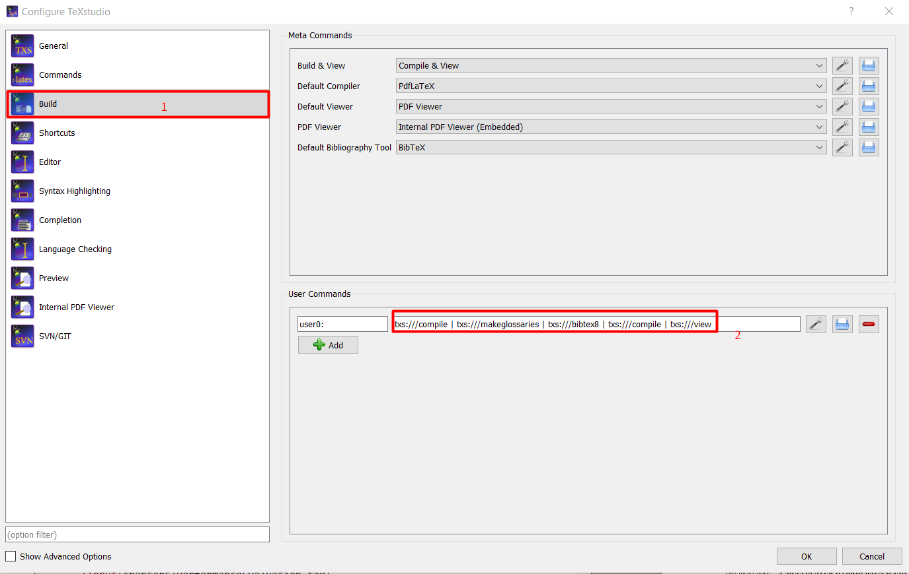
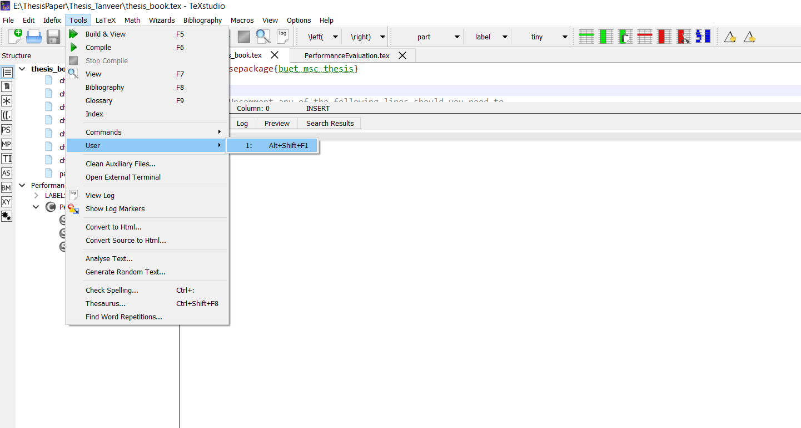

## View Invariant Gait Recognition
==================================

M.Sc. thesis, Md Mahedi Hasan, Defended on September 15, 2020. <br />
Supervisor: <a href="https://hossenmustafa.buet.ac.bd/">Dr. Hossen Asiful Mustafa</a> 

## Quick start

1. Clone this repository.
2. Start adding contents of your thesis into these chapters [`chapters`](./chapters).
3. Add your figures in [`figures`](./figures).
4. Add abstract, and acknowledgement [`pages`](./pages)
5. Change your thesis information here  [`parametes`](./parameters)
6. You can design your thesis format in [`buet_msc_thesis.sty`](./buet_msc_thesis.sty)
7. Add your references here [`buet_msc_thesis.bib`](./buet_msc_thesis.bib)
7. Build the `PDF` by running the following in the command line:

    ```
    make
    ```

8. Open `thesis_book.pdf`.

## Notes
<b>Creating Glossaries</b><br/>
# Linux Machine: ``` makeglossaries thesis_book ```
# Windows Machine: (TexStudio) <br/>
1. Go to Option >> Configure TexStudio >> Build
2. Write this Commend     ``` txs:///compile | txs:///makeglossaries | txs:///bibtex8 | txs:///compile | txs:///view ```
  
3. Run using Tools>>User>>User 0
 


### Reference
Please cite using the following BibTex entry:
```
@phdthesis{chen2018neural,
  title={View Invariant Gait Recognition for Person Re-Identificiation in a Multi Surveillance Camera Environment,
  author={Hasan, Md Mahedi},
  year={2020},
  month={9},
  school={Bangladesh University of Engineering and Technology},
}
```

### Acknowledgement

This thesis is built on top of [sauravdhr's thesis template](https://github.com/sauravdhr/qPMS-Sigma).

### Contact

If you have any comments or questions about the thesis, please use pull requests or email <mahedi0803@gmail.com>.
